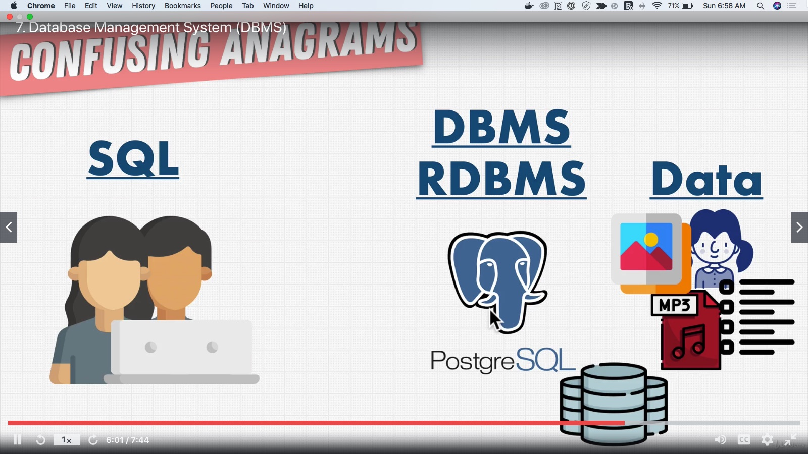

# Complete SQL + Databases Bootcamp: Zero to Mastery [2020]

## Table of Contents

- [Complete SQL + Databases Bootcamp: Zero to Mastery [2020]](#complete-sql--databases-bootcamp-zero-to-mastery-2020)
  - [Table of Contents](#table-of-contents)
    - [Section 1: Introduction](#section-1-introduction)
    - [Section 2: History And Story Of Data](#section-2-history-and-story-of-data)
    - [Section 3: Databases + SQL Fundamentals](#section-3-databases--sql-fundamentals)
    - [Section 4: Environment Setup](#section-4-environment-setup)
    - [Section 5: SQL Deep Dive](#section-5-sql-deep-dive)
    - [Section 6: Advanced SQL](#section-6-advanced-sql)
    - [Section 7: Database Management](#section-7-database-management)
    - [Section 8: Solving The Mystery](#section-8-solving-the-mystery)
    - [Section 9: Database Design](#section-9-database-design)
    - [Section 10: Database Landscape, Performance and Security](#section-10-database-landscape-performance-and-security)
    - [Section 11: Where To Go From Here?](#section-11-where-to-go-from-here)
    - [Section 12: Exrtas: Data Engineering (And the role of Machine Learning)](#section-12-exrtas-data-engineering-and-the-role-of-machine-learning)
    - [Section 13: Extras: Redis](#section-13-extras-redis)
    - [Section 14: Extra Bits: Databases In A Web App (with Node.js)](#section-14-extra-bits-databases-in-a-web-app-with-nodejs)
    - [Section 15: BONUS SECTION](#section-15-bonus-section)

### Section 1: Introduction

- [Live SQL Zoo Study Guide](https://github.com/chesterheng/sql-zoo)
- 

**[⬆ back to top](#table-of-contents)**

### Section 2: History And Story Of Data

#### 5. What Is a Database?

It's a collection of data, a method for accessing and manipulating that data.

Data are collected by many sources

- Drone
- Mobile App
- Web App
- Videocam
- Automobile

**[⬆ back to top](#table-of-contents)**

#### 6. I Didn't Learn Anything, Try Again...

[Why is a database always represented with a cylinder?](https://stackoverflow.com/questions/2822650/why-is-a-database-always-represented-with-a-cylinder)

Data are collected and use by different people

- Product Managers: learn from data to improve the product
- Marketers: analyse business decision
- Web Developers
- Data Analysts: analyse and build machine learning model
- Data Engineer
- Data Administrator

**[⬆ back to top](#table-of-contents)**

#### 7. Database Management System (DBMS)

- How to put data in DB
- How to use/update/learn from data
- How to remove data

Confusing Acronyms

- DBMS: Database Management System
- RDBMS: Relational Database Management System
- SQL: Structured Query Language

Confusing Anagrams

**[⬆ back to top](#table-of-contents)**

#### 8. Exercise: Building Amazon

[SQL Playground](https://www.w3schools.com/sql/trysql.asp?filename=trysql_asc)

**[⬆ back to top](#table-of-contents)**

#### 9. Exercise: Building Amazon 2

**[⬆ back to top](#table-of-contents)**

#### 10. 5 Types Of Databases

5 data models

- Relational: support asset transactions
- Document: data is in a document, scalability
- Key Value: simple way to access data
- Graph: good for connected data
- Wide Columnar

**[⬆ back to top](#table-of-contents)**

#### 11. Exercise: What Is A Database?

- A database is a hardware and software system that allows a user to store, organize and use data.
- A database stores data and provides answer to query based on its data. 

**[⬆ back to top](#table-of-contents)**

#### 12. Section Review

- Do you have useful data?
- Install a DB to Store Data
- Use SQL to Setup + Use Data

**[⬆ back to top](#table-of-contents)**

### Section 3: Databases + SQL Fundamentals
**[⬆ back to top](#table-of-contents)**

### Section 4: Environment Setup
**[⬆ back to top](#table-of-contents)**

### Section 5: SQL Deep Dive
**[⬆ back to top](#table-of-contents)**

### Section 6: Advanced SQL
**[⬆ back to top](#table-of-contents)**

### Section 7: Database Management
**[⬆ back to top](#table-of-contents)**

### Section 8: Solving The Mystery
**[⬆ back to top](#table-of-contents)**

### Section 9: Database Design
**[⬆ back to top](#table-of-contents)**

### Section 10: Database Landscape, Performance and Security
**[⬆ back to top](#table-of-contents)**

### Section 11: Where To Go From Here?
**[⬆ back to top](#table-of-contents)**

### Section 12: Exrtas: Data Engineering (And the role of Machine Learning)
**[⬆ back to top](#table-of-contents)**

### Section 13: Extras: Redis
**[⬆ back to top](#table-of-contents)**

### Section 14: Extra Bits: Databases In A Web App (with Node.js)
**[⬆ back to top](#table-of-contents)**

### Section 15: BONUS SECTION
**[⬆ back to top](#table-of-contents)**